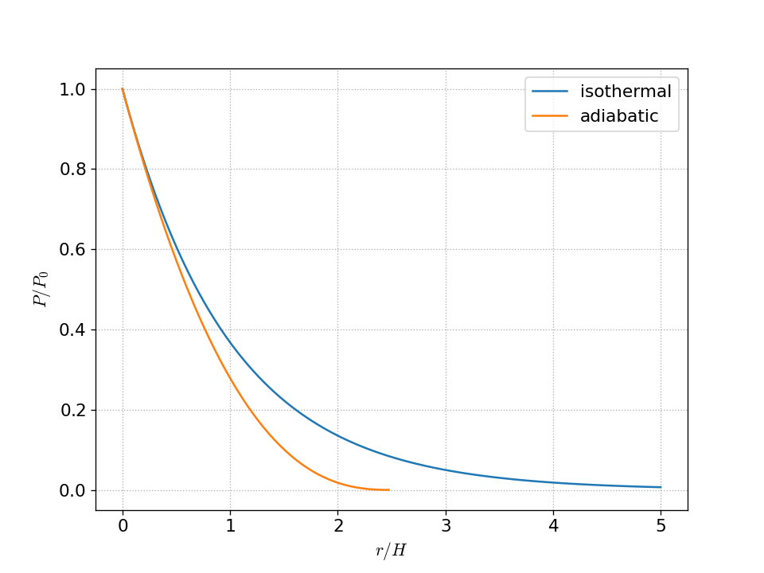

# Homework 4 solutions

## 1. Adiabatic index

We want to compute

$$\Gamma_1 = \left . \frac{d\log P}{d\log \rho} \right |_s = \frac{\rho}{P} \left . \frac{dP}{d\rho} \right |_s$$

for a gas composed of a mix of an ideal gas and radiation:

$$P = \frac{1}{3} a T^4 + \frac{\rho k T}{\mu m_u}$$

The corresponding specific energy is:

$$e = \frac{a  T^4}{\rho} + \frac{3}{2} \frac{kT}{\mu m_u}$$

We start by writing our EOS as $P = P(\rho, T(\rho, s))$ and then
takking the derivative with respect to density:

$$\left . \frac{dP}{d\rho} \right |_s
   = \left . \frac{\partial P}{\partial \rho} \right |_T
                      + \left . \frac{\partial P}{\partial T} \right |_\rho  \left . \frac{dT}{d\rho} \right |_s $$

Now, from the first law of thermodynamics, we take entropy to be constant:

\begin{align*}
dq = 0 &= de + P d\left ( \frac{1}{\rho} \right ) \\
       &= \left . \frac{\partial e}{\partial T} \right |_\rho dT
        + \left . \frac{\partial e}{\partial \rho} \right |_T d\rho - \frac{P}{\rho^2} d\rho
\end{align*}

where we expanded out $de$ in terms of $T$ and $\rho$.  This shows us that:

$$\left . \frac{dT}{d\rho} \right |_s =
  \left ( \left . \frac{\partial e}{\partial T} \right |_\rho \right )^{-1}
  \left (\frac{P}{\rho^2} - \left . \frac{\partial e}{\partial \rho} \right |_T \right )$$

Now we need to compute all the derivatives.  From our equation of state, we have:

$$\left . \frac{\partial P}{\partial \rho} \right |_T = \frac{kT}{\mu m_i} = \frac{P_g}{\rho}$$

$$\left . \frac{\partial P}{\partial T} \right |_\rho =
  \frac{4}{3} a T^3 + \frac{\rho k}{\mu m_u} = \frac{1}{T} \left ( 4 P_\gamma + P_g \right )$$

$$\left . \frac{\partial e}{\partial \rho} \right |_T =
  - \frac{aT^4}{\rho^2} = -\frac{3P_\gamma}{\rho^2}$$

$$\left . \frac{\partial e}{\partial T} \right |_\rho =
 4 \frac{aT^3}{\rho} + \frac{3}{2} \frac{k}{\mu m_u} = 12 \frac{P_\gamma}{\rho T} + \frac{3}{2} \frac{P_g}{\rho T}$$

Then inserting these into the above expression for $dT/d\rho |_s$, we have:

$$\left . \frac{dT}{d\rho} \right |_s = \frac{T}{\rho} \frac{1 + 3 (1-\beta)}{12 (1- \beta) + \frac{3}{2}\beta}
  = 2 \frac{T}{\rho} \frac{4 - 3\beta}{24 - 21\beta}$$

and finally:

\begin{align*}
\left . \frac{dP}{d\rho} \right |_s &= \frac{\beta P}{\rho} +
       \frac{P}{T} \left [ 4(1-\beta) + \beta\right ] 2 \frac{T}{\rho}
         \frac{4 - 3\beta}{24 - 21\beta} \\
&=\frac{P}{\rho} \frac{32 - 24\beta -3 \beta^2}{24 - 21\beta}
\end{align*}

so

$$\Gamma_1 = \frac{32 - 24\beta -3 \beta^2}{24 - 21\beta}$$

We see that this has the proper limits:

* Pure gas pressure: $\beta = 1 \rightarrow \Gamma_1 = 5/3$

* Pure radiation pressure: $\beta = 0 \rightarrow \Gamma_1 = 4/3$

## Convectively unstable atmosphere

### a.

We want to find the profile of an isentropic plane-parallel atmosphere.  We have:

$$\frac{dP}{dr} = -\rho |g|$$

where $g$ is constant.  If the gas is adiabatic, then the EOS takes the form:

$$P = K \rho^{\Gamma_1}$$

Putting this together, we have:

\begin{align*}
\Gamma_1 K \rho^{\Gamma_1 - 1} \frac{d\rho}{dr} &= -\rho |g| \\
\rho^{\Gamma_1 - 2} d\rho &= - \frac{|g|}{\Gamma_1 K} dr
\end{align*}

This can be integrated.  We take $P(r = 0) = P_0$, $\rho(r=0) = \rho_0$  and find:

$$\rho(r) = \rho_0 \left ( 1 - \frac{\Gamma_1 - 1}{\Gamma_1} \frac{|g|}{K} \frac{1}{\rho_0^{\Gamma_1 - 1}} r \right )^{1/(\Gamma_1 - 1)}$$

we can eliminate $K$ as $K = P_0 / \rho_0^{\Gamma_1}$ and get:

$$\rho(r) = \rho_0 \left ( 1 - \frac{\Gamma_1 - 1}{\Gamma_1} \frac{|g|\rho_0}{P_0}  r \right )^{1/(\Gamma_1 - 1)}$$

or in terms of the scale height, $H = P_0 / (\rho_0 |g|)$, 

$$\rho(r) = \rho_0 \left ( 1 - \frac{\Gamma_1 - 1}{\Gamma_1} \frac{r}{H} \right )^{1/(\Gamma_1 - 1)}$$

Then since $P(r) = K\rho^{\Gamma_1}$, we have:

$$P(r) = \rho_0 \left ( 1 - \frac{\Gamma_1 - 1}{\Gamma_1} \frac{r}{H} \right )^{\Gamma_1/(\Gamma_1 - 1)}$$

### b.

Here's a plot

Notice that the adiabatic atmosphere falls off much faster than the isothermal atmosphere.

## Solar convection

We want to find the thermodynamic profile in the Sun's convective envelope.  If we are convecting, then
the temperature gradient is just the adiabatic gradient:

$$\frac{dT}{dr} = \left ( 1 - \frac{1}{\gamma} \right ) \frac{T}{P} \frac{dP}{dr}$$

now, we use HSE to replace $dP/dr$ and the ideal gas law to replace $T/P$, and assume that
all of the mass of the Sun is beneath the convective layer.  This gives:

\begin{align*}
\frac{dT}{dr} &= \left (1 - \frac{1}{\gamma} \right )  \frac{\mu m_u}{\rho k} \left [ -\rho \frac{G M_\odot}{r^2} \right ] \\
    &= - \left ( 1 - \frac{1}{\gamma} \right ) \frac{\mu m_u GM_\odot}{k} \frac{1}{r^2}
\end{align*}

We can integrate this from the base of the convective layer, $R_\mathrm{base}$ to some point inside the convective layer:

$$\int_{T_\mathrm{base}}^{T(r)} dT = - \left ( 1 - \frac{1}{\gamma} \right ) \frac{\mu m_u G M_\odot}{k} \int_{R_\mathrm{base}}^r \frac{dr^\prime}{{r^\prime}^2}$$

This gives:

$$T(r) = T_\mathrm{base} - \left ( 1 - \frac{1}{\gamma} \right ) \frac{\mu m_u GM_\odot}{k} \left (\frac{1}{R_\mathrm{base}} - \frac{1}{r}\right )$$

Now $\mu$ is a constant, since the convective zone is well mixed.  If we write the atomic number as $\mathcal{Z}$ and atomic weight as $\mathcal{A}$,
then

$$\frac{1}{\mu} = \sum_k \frac{\mathcal{Z}_k X_k}{\mathcal{A}_k} \approx 2 X + \frac{3}{4} Y + \left \langle \frac{\mathcal{Z}}{\mathcal{A}} \right \rangle Z$$

and if we take $\langle \mathcal{Z}/\mathcal{A} \rangle \approx 1/2$, then we get $\mu \approx 0.6$.

For pressure and density, we start with an adiabatic equation of state:

$$P = K \rho^\gamma$$

and then into HSE:

\begin{align*}
\frac{dP}{dr} &= - \frac{GM_\odot}{r^2} \rho \\
\gamma K \rho^{\gamma - 1} \frac{d\rho}{dr} &= - \frac{GM_\odot}{r^2} \rho \\
\rho^{\gamma-2} d\rho &= -\frac{GM_\odot}{\gamma K} \frac{dr}{r^2}
\end{align*}

we can now integrate this from the base of the convective layer to a point in the interior:

$$\int_{\rho_\mathrm{base}}^{\rho(r)} \rho^{\gamma - 2} d\rho = - \frac{GM_\odot}{\gamma K} \int_{R_\mathrm{base}}^r \frac{dr^\prime}{{r^\prime}^2}$$

doing this integral gives:

$$\rho = \rho_\mathrm{base} \left [ 1 - \frac{GM}{K\rho^{\gamma-1}} \frac{\gamma - 1}{\gamma} \left ( \frac{1}{R_\mathrm{base}} - \frac{1}{r} \right ) \right ]^{1/(\gamma-1)}$$

But since $K = P_\mathrm{base}{\rho_\mathrm{base}}$, we have

$$\rho = \rho_\mathrm{base} \left [ 1 - \frac{GM\rho_\mathrm{base}}{P_\mathrm{base}} \frac{\gamma - 1}{\gamma} \left ( \frac{1}{R_\mathrm{base}} - \frac{1}{r} \right ) \right ]^{1/(\gamma-1)}$$

and then

$$P = P_\mathrm{base} \left [ 1 - \frac{GM\rho_\mathrm{base}}{P_\mathrm{base}} \frac{\gamma - 1}{\gamma} \left ( \frac{1}{R_\mathrm{base}} - \frac{1}{r} \right ) \right ]^{\gamma/(\gamma-1)}$$

